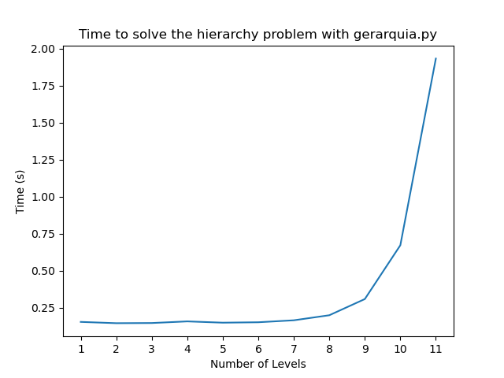
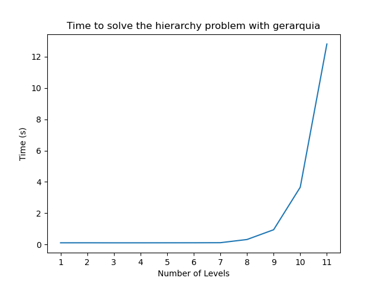

# Llinatges
El problema abordat en aquesta pràctica és la cerca dels nodes fills més allunyats donat un node d'un arbre n-ari. L'objectiu és implementar aquesta funcionalitat en dos llenguatges de programació: Python i Haskell, cadascun enfocat a resoldre el problema d'una forma diferent (iterativa amb Python i de recursiva amb Haskell).
Al final, totes dues implementacions haurien de tenir el mateix cost computacional, i això és el que analitzarem en aquest document.


## Anàlisi Teòric

En aquest apartat ens centrem solament en les funcions principals considerant que ja tenim carregades a memòria les dades obtingudes del fitxer.

### Implementació en Python

La primera part del nostre algorisme se centra a crear un diccionari que representarà els nodes de l'arbre. El format que seguirà aquest diccionari serà de la forma:
```
{'Parent-1':[Childs],'Parent-2':[Childs], ... ,'Parent-N':[Childs]}
```
La funció encarregada de crear aquesta conversió és la mostrada a continuació i rebrà parelles Pare-Fill que anirà afegint al diccionari a retornar:
```
def construct_tree(edges):                Cost   Times
    root_value = edges[0][0]              C1     1
    tree_dict = {root_value: []}          C2     1
    for parent, child in edges:           C3     n
        if parent not in tree_dict:       C4     n
            tree_dict[parent] = []        C5     n
        tree_dict[parent].append(child)   C6     n
    return tree_dict                      C7     1 
```
Les dues primeres línies solament serveixen per inicialitzar el diccionari i s'executen en temps constant, el bucle `for` té cost `n` en funció del nombre de parelles que rebi la funció. Per cada parella haurà de comprovar si la clau es troba en el diccionari, encara que en diccionaris, en estar implementats amb hash tables, el cost mitjà de cerca al seu interior és constant.

Així, de forma general i considerant que operacions d'inserció i cerca en un diccionari estan implementades amb hash tables, i per tant amb un cost mitjà constant, aquesta funció tindria una complexitat O(n) en funció del nombre de parelles que rebi, ja que necessàriament ha d'iterar per totes elles en el bucle `for`.

La següent funció és l'encarregada de realitzar la cerca dels nodes fill més allunyats donat un node de l'arbre en concret:
```

def search_deepest_childs(tree_dict, node_value):   Cost  Times
    stack = [(node_value, 0)]                       C1    1
    while stack:                                    C2    n    
        node, depth = stack.pop()                   C3    n-1
        children = tree_dict.get(node, [])          C4    n-1
        if not children:                            C5    n-1
            yield node, depth                       C6    n-1
        else:                                      
            for child in children:                  C7    n*c
                stack.append((child, depth + 1))    C8    n*c
```
La inicialització de l'stack (C1) serà de cost constant O(1). El bucle encarregat d'efectuar les operacions s'executarà sempre que existeixen elements dins de l'stack. En el pitjor dels casos contindrà tots els elements i, per tant, el seu cost serà O(n) en funció del nombre d'elements.
L'operació `pop` és de cost constant (O(1)) i el `get`, com hem comentat amb anterioritat també tendeix a una mitjana constant O(1).

El primer condicional comprova si existeixen nodes fills després d'obtenir-los del diccionari. Aquesta acció de comprovar si existeix algun valor és de cost constant en diccionaris de Python i executar el `yield` també.
En cas que existeixi algun node fill els haurem de recórrer per afegir-los a l'stack. Aquesta operació s'executaria per cada node fill, diguem-li `c`, solament **un** cop i, per tant, el cost d'aquesta operació es pot considerar de cost constant O(1). D'aquesta manera, estem afegint a l'stack, en els pitjors dels casos, cada node de l'arbre `n`.

D'aquesta manera, podem aproximar el cost com:
```
T(n) = C1 + C2 * (C3 + C4 + C5 + C6 + (C7 * C8))
     = 1 + n * (1 + 1 + 1 + 1 + (c))
     = 1 + 5n + n*c
     = n
```
Obtenint un cost lineal: O(n).

Aquest algorisme ens permet obtenir els fills del node i la profunditat en la qual es troben. A continuació, requerim una funció que ens permeti classificar tots els nodes trobats en funció de la seva profunditat:

```
                                               Cost Times
result_dict = {}                                 C1   1
for letter, number in generator:                 C2   n
    if number in result_dict:                    C3   n
        result_dict[number].append(letter)       C4   n
    else:
        result_dict[number] = [letter]           C5   n
```

Aquest bucle iterarà sobre tots els elements retornats per la funció anterior i agruparà cada node en funció de la seva profunditat. El seu cost depèn del bucle `for` i la resta d'operacions són de cost constant. Per aquest motiu, el cost és O(n).

I finalment agafarem els nodes més profunds del diccionari, aquells que tinguin la profunditat més gran. Per això requerim trobar el màxim entre les diferents claus del diccionari:
```
result_dict[max(result_dict.keys())]
```

El cost de la funció max() és O(n). Podríem pensar que obtenir les claus del diccionari també és lineal, però amb Python3 s'utilitza una vista, operació que resulta molt eficient tenint un cost mitjà de O(1).

Aleshores podem calcular el cost total d'aquesta implementació:
```
T(n) = construct_tree(n) + search_deepest_childs(n) + result_dict(n) + max(n) =
     = n + n + n + n 
     = 4n
     = n
```
Sent la funció de cerca la predominant mostrant un cost O(n).

### Implementació en Haskell
La implementació en Haskell s'ha de realitzar de forma recursiva, ja que aquesta és la gràcia del llenguatge, però segueix un procediment molt similar que el realitzat amb Python.

Primer convertirem les dades obtingudes del fitxer a una llista de parelles amb el format (Pare:Fill) :
```
createPairs :: [String] -> [(String, String)]   Cost Times
createPairs = map createPair                    C1    n

createPair :: String -> (String, String)
createPair str = case words str of              C2    1
    (father:child:_) -> (father, child)
    _ -> error "Invalid format. Expected 'Father child'."
```
Aquesta funció aprofita el `map` per executar la funció `createPair` per cada element de la llista. La funció `createPair` simplement converteix l'string al format parella i, per tant, en un temps constant O(1). La complexitat de la funció en conjunt és de O(n) en haver d'efectuar aquesta operació constant per cada element de la llista inicial: 1*n = n -> O(n).

A continuació hem de construir un diccionari representant l'arbre que estem tractant:
```
buildTree :: [(String, String)] -> Map.Map String [String]
buildTree = foldl insertPair Map.empty
  where
    -- Inserting pairs into the tree dictionary
    insertPair tree (parent, child) = Map.insertWith (++) parent [child] tree
```
Centrant-nos en insertar les parelles al diccionari foldl `insertPair Map.empty` ha d'aplicar `insertPair` a cada parell de la llista obtenint un cost O(n) a causa de la iteració sobre la llista de n parelles.
La funció `insertPair` simplement afegeix una nova entrada al diccionari o amplia el nombre de fills d'un determinat node. El temps serà d'O(1) per a la majoria d'operacions en diccionaris moderns basats en hash. En casos rars amb col·lisions de hash o rehashing, podria ser lleugerament superior, però considerem un temps mitjà. Assolint finalment un cost O(n) sent `map` el cost predominant.

Per acabar, amb les dades creades i organitzades en un diccionari podem realitzar la cerca dels nodes:
```
deepestChildren :: Map.Map String [String] -> String -> Maybe [String]          Cost Times
deepestChildren tree key = sort <$> deepestHelper tree [key]                    C1   1

deepestHelper :: Map.Map String [String] -> [String] -> Maybe [String]
deepestHelper _ [] = Nothing                                                    C2   1
deepestHelper tree parents =
    let children = concatMap (\p -> fromMaybe [] (Map.lookup p tree)) parents   C3   c
    in if null children                                                         C4   n
       then Just parents                                                        C5   n
       else deepestHelper tree children                                         C6   n
```
La nostra funció depèn de la crida a una funció auxiliar `deepestHelper`. Aquesta crida solament s'executarà un cop i per tant tindrà cost constant O(1). La funció `deepestHelper` és la que executa les crides recursives i insercions al diccionari final. El cas base és quan la parella es buida i el fet de retornar `nothing` tindrà cost constant. 
La crida recursiva es pot resumir en una iteració sobre la llista de claus representant els pares. Per a cada clau, comprova si ja existeix com a clau al diccionari d'arbre.
Si el pare existeix, obté la llista dels seus fills del diccionari.
Si el pare no existeix, considera que el pare no té fills (llista buida).
Finalment, concatena totes aquestes llistes de fills en una única llista i l'assigna a la variable fills. A l'hora de concatenar aquesta llista de fills solament afegirà cada node un cop. 
El cost d'aquesta funció es redueix a O(n) en concret amb l'operació `concatMap` en existir la possibilitat de concatenar tots els fills o nodes de l'arbre.

Si tornem a calcular el cost en conjunt del programa, obtenim que:
```
T(n) = createPairs(n) + buildTree(n) + deepestChildren(n) + sort(n) = 
     = n + n + n + n
     = 4n
     = n
```
Que és el mateix cost obtingut en la implementació en Python.


## Anàlisi Experimental

A continuació es mostraran els resultats experimentals obtinguts en totes dues implementacions. Per calcular aquests costos experimentals s'han utilitzat diferents nivells de l'estructura d'arbre n-ari i es calcula el temps d'execució de cada nivell per finalment obtenir les gràfiques mostrades a continuació.

### Python

{width=195px}

Com es pot observar en aquesta gràfica, el cost experimental pel codi de Python no varia massa pels 5 primers nivells, però a partir d'aquí el temps d'execució comença a incrementar-se, fent-se notar aquest creixement encara més a partir dels 8 nivells i convertint-se en exponencial a partir dels 10.


### Haskell

{width=195px }

Com es pot observar en aquesta gràfica, el cost experimental pel codi de Haskell es manté constant fins als primers 7 nivells, on comença a créixer, fent-se notar aquest canvi, encara més, a partir dels 9 nivells i convertint-se en exponencial a partir dels 10. Com es pot veure, el cost experimental del nostre codi és molt més alt en Haskell que en Python, arribant fins als 12 segons d'execució pels 11 nivells, mentre que a Python, pel mateix nombre de nivells, és d'1.75 segons.

D'aquests costos en podem extreure dues conclusions principals:

1. **Cost Exponencial:** Encara que a nivell teòric hem trobat un cost O(n) en funció del nombre de nodes, la quantitat de nodes que ha de tractar la funció incrementa de forma exponencial. Això és degut al fet que un arbre n-ari, en funció del nombre de nivells que tingui, anirem incrementant el nombre de fills per n i de forma general el nombre de nodes en un arbre n-ari escala en `n^n`. Per tant, encara que la complexitat de la funció sigui lineal les dades que ha de tractar son tan grans que el cost experimental incrementa exponencialment.

2. **Implementacions en LLenguatges**: Encara que els costs i implementacions en tots dos llenguatges són equivalents, Haskell presenta una diferència molt gran en els temps d'execució, sobretot en tractar amb arbres d'11 nivells, mida considerablement gran. Després de certa recerca hem trobat que les implementacions dels diccionaris en Haskell no utilitzen HashMaps, estructures de dades molt eficients, que en el cas de Python sí s'utilitzen de forma interna, incrementant molt l'eficiència.

## Conclusions

Encara que el cost obtingut en aquesta implementació ha resultat ser O(n), no podem evitar pensar si existiria un cost més eficient. Al final, l'algorsime que hem estat utilitzant no deixa de ser una implementació del DFS (Depth First Search). Si intentéssim aconseguir una complexitat temporal d'O(log n), normalment hauríem de modificar l'algorisme per reduir el nombre de nodes o arestes visitades durant el recorregut. No obstant això, en una estructura d'arbre jeràrquica general, no és possible obtenir la complexitat O(log n) per a tasques com trobar els nodes més profunds, ja que encara seria necessari travessar tots els nodes en el pitjor dels casos.

A nivell d'experimentació amb els temps d'execució ha estat interessant observar com diferents llenguatges s'enfoquen a l'hora de realitzar certes implementacions. En el cas de Python hem mencionat que es fan servir HashTables, el que aporta costos pràcticament constants en moltes operacions dins del diccionari, menters que Haskell opta per una implementació sense HashTables per diferents motius:

- Prioritza la immutabilitat, mentre que les taules hash requereixen mutabilitat per a les operacions.

- La programació funcional es basa en funcions pures, i les taules hash introdueixen aleatorietat.

- Els arbres equilibrats ofereixen un rendiment més predictible en Haskell que les taules de hash (Encara que en aquest cas no ha afavorit gaire).

- La programació funcional valora el comportament determinista, i les taules de hash poden ser no deterministes.


En general, és una pràctica que aporta una visió diferent a l'hora d'enfocar un mateix problema en dues formes d'implementació.

###### Èric Bitriá i David Blanco
